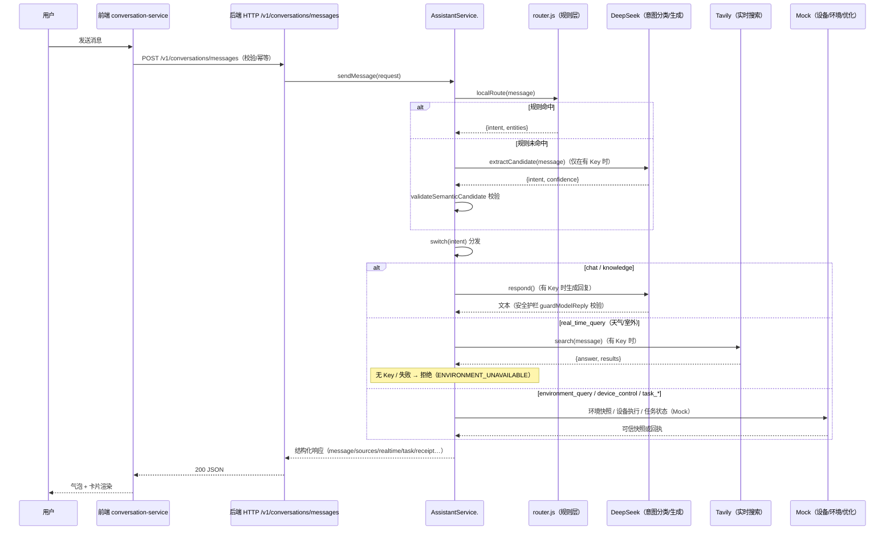

# 呼吸森林 V2 · AI 用户输入 → 输出完整链路

本文描述一次对话消息从用户输入到最终回复的完整处理链路，并明确每一步：**何时调用外部 API（DeepSeek / Tavily）、何时使用本地规则、何时回退到 mock**。

## 总体时序

## 分层判定顺序

`AssistantService.#process`（backend/src/conversation/assistant-service.js）先走**规则层** `localRoute`（backend/src/conversation/router.js）。规则是精确、可测试、确定性的，优先于模型。只有规则没有命中时，才在**有 DeepSeek Key** 的情况下调用 `extractCandidate` 做意图分类，分类结果再经 `validateSemanticCandidate` 白名单校验（只允许已知 intent，实体仍从用户原文按规则提取，模型无法编造设备/数值/结果）。

## 何时调用 API / 规则 / mock

| 输入示例 | 判定层 | 外部 API | 本地规则 | Mock / 兜底 |
|---|---|---|---|---|
| 「打开空气净化器」 | 规则 → `device_control` | 不调用 | requestedState / 设备解析 / 策略裁决 | 设备执行器（Mock 回执） |
| 「现在空气怎么样」 | 规则 → `environment_query` | 不调用 | metricList（PM2.5/CO₂/湿度/温度/评分） | 环境快照（Mock/sensor） |
| 「今天天气怎么样」「AQI 是多少」 | 规则 → `real_time_query` | **Tavily search**（有 Key） | 无 Key → 规则直接拒绝 | 无 Key / 搜索失败 → 拒绝 ENVIRONMENT_UNAVAILABLE |
| 「PM2.5 是什么」「为什么下雨要通风」 | 规则 → `knowledge_query` | **DeepSeek respond**（有 Key） | 命中知识库 topic | 无模型 → 本地固定知识库 |
| 「你好」「聊聊」 | 规则 → `chat` | **DeepSeek respond**（有 Key） | 问候模板 | 无模型 → 固定问候模板 |
| 无法识别的口语（规则未命中） | **DeepSeek extractCandidate** | **DeepSeek 意图分类**（有 Key） | validateSemanticCandidate 白名单 | 模型不可用 → 引导回复 `#unknownGuidance` |
| 「开启烹饪守护」「舒适优先优化」 | 规则 → `cooking_guard_create` / `optimization_create` | 不调用 | 固定模板 + 模式映射 | Mock 任务 / Mock 优化器 |
| 「暂停任务」等 | 规则 → `task_*` | 不调用 | 任务状态机 | 本地 TaskService |

## 三个引擎的调用时机

1. **DeepSeek（`backend/src/adapters/deepseek.js`）**
   - **意图分类**：仅在规则未命中时调用 `extractCandidate`（temperature 0、max_tokens 128、严格 JSON）。模型不可用/超时/非法 → 返回固定 unknown，不 throw。
   - **文本生成**：`chat` / `knowledge` 且 `available` 时调用 `respond`；输出经 `guardModelReply` 安全护栏，失败降级到模板/知识库。
   - 开关：`backend/.env` 的 `DEEPSEEK_ENABLED`、`DEEPSEEK_API_KEY`。

2. **Tavily（`backend/src/adapters/tavily.js`）**
   - 仅 `real_time_query`（天气/室外）且 `available` 时调用 `search`（`api_key`、`query`、`max_results`、`include_answer`）。
   - 无 Key / 搜索失败 → 返回 null，服务层拒绝 `ENVIRONMENT_UNAVAILABLE`（不编造室外数值，绝不把室内快照当室外数据）。
   - 开关：`backend/.env` 的 `TAVILY_ENABLED`、`TAVILY_API_KEY`。

3. **Mock（`FakeDeviceAdapter` / `FakeEnvironmentAdapter` / `FakeOptimizerAdapter` / 前端 UI Mock）**
   - 设备执行、环境快照、模拟优化、前端未连后端时的 UI 降级，全部为本地 Mock，来源以 `sources` 中的 `mock` 标记，不会冒充真实数据。

## 前端如何消费

- `frontend/src/services/conversation-service.js`：组装请求（conversationId / idempotencyKey / locale / timezone），POST 到 `http://127.0.0.1:8787/v1/conversations/messages`，5s 超时，503 或异常降级为 UI Mock。
- `frontend/src/main.js` `applyConversationResponse`：把后端返回的 `responseType / sources / realtime / task / receipt / error` 落到消息对象。
- `frontend/src/components/message-cards.js`：按 `responseType` 渲染气泡标签；`realtime` 字段渲染「实时引擎 · Tavily」卡片与来源链接。
- 首页右上角「实时情况」徽章：后端 bootstrap 的 `realtime.available` 为 true 时显示绿色脉冲「实时情况」，否则显示「本地模拟」。

## Key 缺失的降级链（诚实兜底）

- 无 `DEEPSEEK_API_KEY`：意图分类跳过（规则未命中 → 引导回复）；chat/knowledge 用固定模板/知识库。
- 无 `TAVILY_API_KEY`：天气/室外 → 拒绝「无可信外部实时数据源」，绝不编造。
- 后端不可用：前端自动降级为 UI Mock，并在消息与徽章上明确标注「本地 UI Mock / 未连接后端」。
