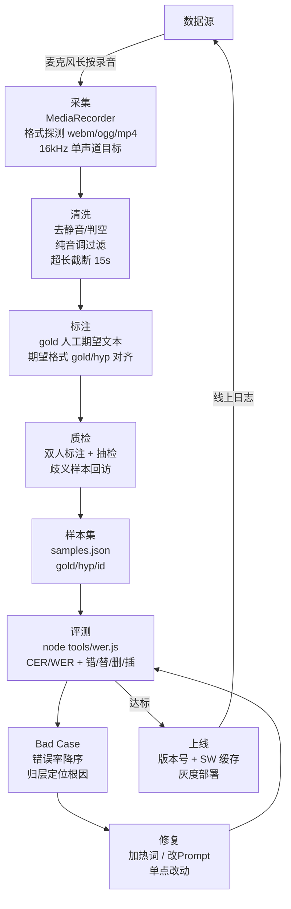

# 语音技术架构图 + 数据生产流程图（Mermaid）

> 面试用途：面试 PPT / 白板题直接粘贴渲染。两张图对应学习计划第 1 天（语音架构）与第 6 天（数据生产）的产出物。
>
> Mermaid 可直接在 GitHub Markdown、Typora、mermaid.live 渲染。
> 代码出处：`backend/src/adapters/dashscope-asr.js`、`mimo-tts.js`、`backend/src/conversation/mimo-easter.js`、`frontend/src/utils/audio.js`、`frontend/src/services/tts-service.js`。
> 当前版本：v20260808-11（已含语音播报）。

---

## 1. 语音技术架构图（ASR / Speech LLM / TTS 完整链路）

```mermaid
flowchart LR
    U[用户语音<br/>长按录音] --> REC[前端录音<br/>MediaRecorder<br/>webm/ogg/mp4 回退<br/>15s 上限]
    REC --> ASR[ASR<br/>qwen3-asr-flash<br/>OpenAI-compatible<br/>内联 base64]
    ASR -- "转写文本" --> SPEECH[Speech LLM<br/>DeepSeek 一次调用<br/>意图判断+歌名+接续]
    ASR -- "空/失败" --> NULL[判空 → 503<br/>提示重试]
    SPEECH -- "严格 JSON<br/>isSinging/songName/continuation" --> PARSER[容错解析<br/>剥code block + 截{}]
    PARSER -- "是唱歌" --> TSING[TTS 唱歌<br/>MiMo (唱歌)标签<br/>茉莉音色]
    PARSER -- "普通对话" --> CHAT[正常对话<br/>/v1/conversations/messages]
    CHAT --> TALK[TTS 播报<br/>/v1/tts/speak<br/>MiMo 正常合成]
    TSING --> AUDIO[base64 WAV]
    TALK --> AUDIO
    AUDIO --> FRONT[前端 Web Audio 播放<br/>手势解锁 AudioContext]

    %% 降级链路
    ASR -. 任意失败 .-> NULL
    SPEECH -. 任意失败 .-> CHAT
    TALK -. 任意失败 .-> TEXTONLY[仅文字回复<br/>不打断对话]
    TSING -. 任意失败 .-> CHAT
```

**讲解口径（面试用）**：这是「语音 Agent 的完整**双向**闭环」——说话进（ASR）、回话出（TTS），唱歌彩蛋是回话分支里的人格化模式。

- **技术选型对比**：qwen3-asr-flash 走 `compatible-mode/v1/chat/completions` 内联音频（同步、简单、中文稳），对比 paraformer-v2 无同步 HTTP 接口（需公网 URL + 异步轮询或 WebSocket）后弃用——一句话能讲清"为什么选它"。
- **一次调用干三件事**（`mimo-easter.js`）：意图判断 + 歌名识别 + 接续歌词，用强制 JSON 输出降一次网络往返。
- **双向闭环的价值**：用户腾不开手（做饭、进卧室）时能听到回复，这是语音助手的核心场景；`/v1/tts/speak` 让「对话回复 → 语音播报」成为主干，唱歌彩蛋复用同一套 TTS + 播放 + 降级基础设施。
- **降级设计是产品安全网**：播报失败只丢声音、文字回复照常展示；彩蛋失败回落普通对话。用户永远不被"卡死"。

---

## 2. 数据生产流程图（采集 → 清洗 → 标注 → 质检 → 闭环）



**讲解口径（面试用）**：数据闭环 = 采集、清洗、标注、质检、评测、回流。

- **采集端即数据管道**：录音端已做格式探测、超时截断、权限处理（`audio.js`），天然是"采集+清洗"的第一步。
- **标注 → 评测形成回路**：`wer.js` 把「人工期望（gold）」与「实际转写（hyp）」对齐，错误率降序直接喂给 Bad Case 分析，修复后回归同一批样本——这是数据驱动迭代的最小闭环。
- **双向语音扩大数据面**：新增的 `/v1/tts/speak` 播报本身也是数据源——TTS 合成质量（音色/断句/时长）同样需要评测与回放，可并入本闭环的"评测"环节。
- **隐私合规（面试必提）**：语音含生物信息，需用户授权、脱敏、不落库明文；本项目 API Key 不入库、失败静默降级不泄露，是合规的最低姿态。
- **数据泄漏风险**：评测集必须与训练/调优数据分离，否则指标虚高；样本集中同一句话不重复进训练与评测两侧。
